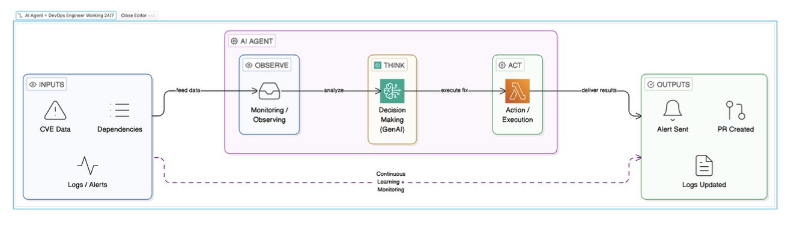
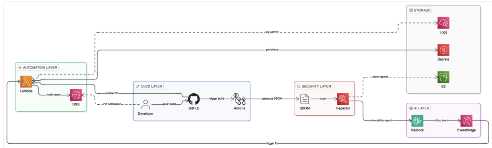
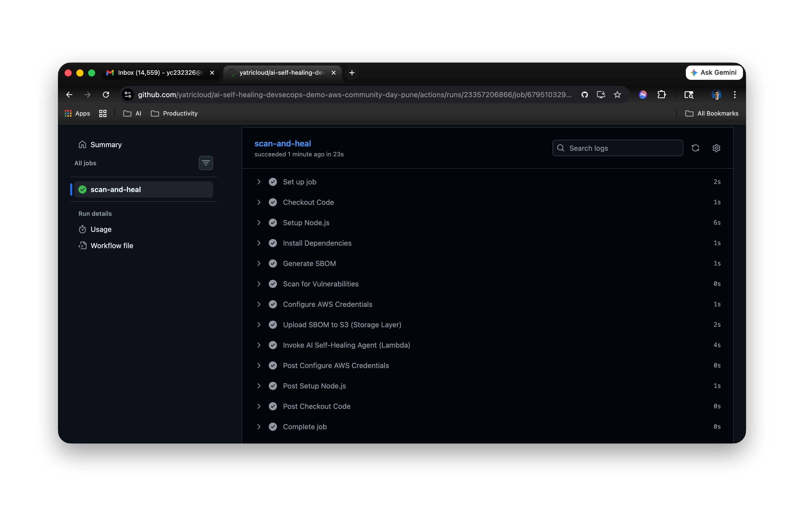
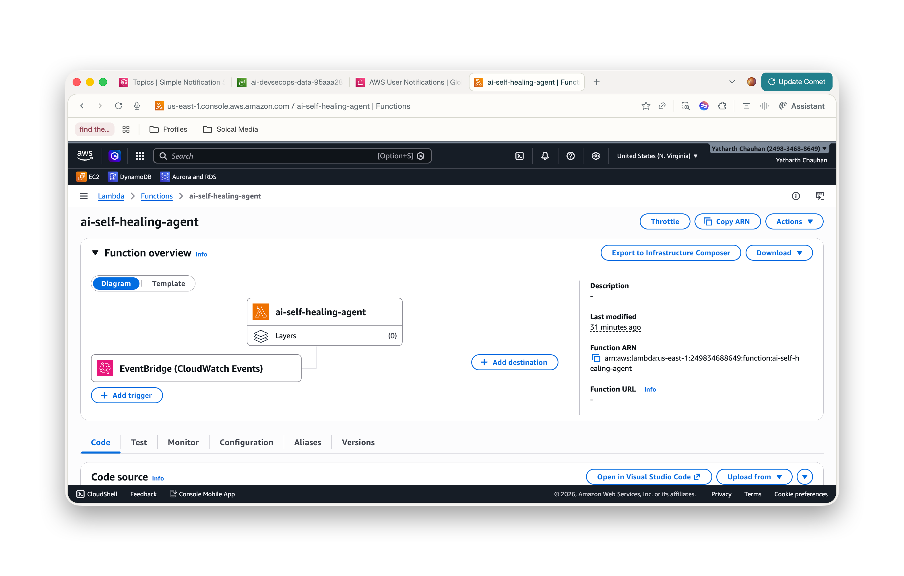
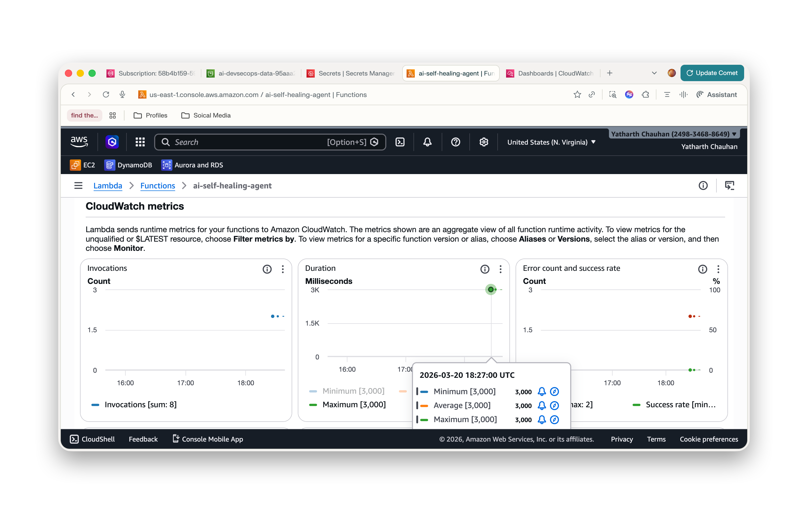
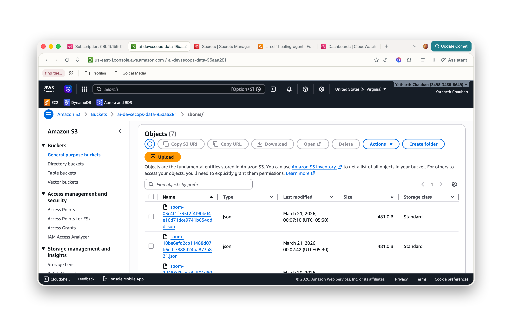
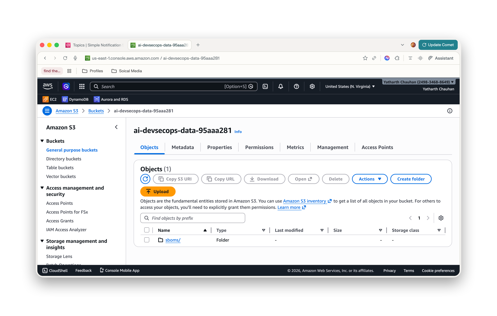
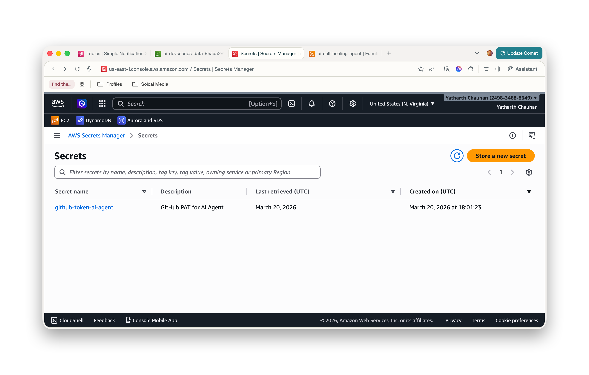
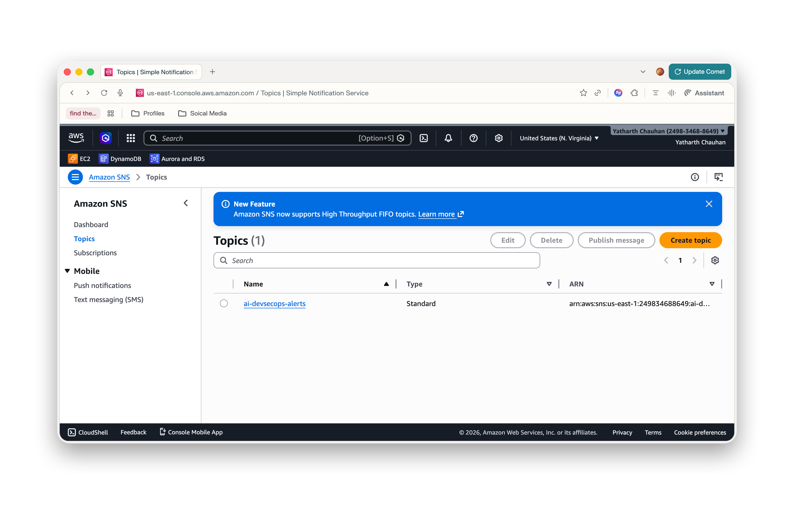
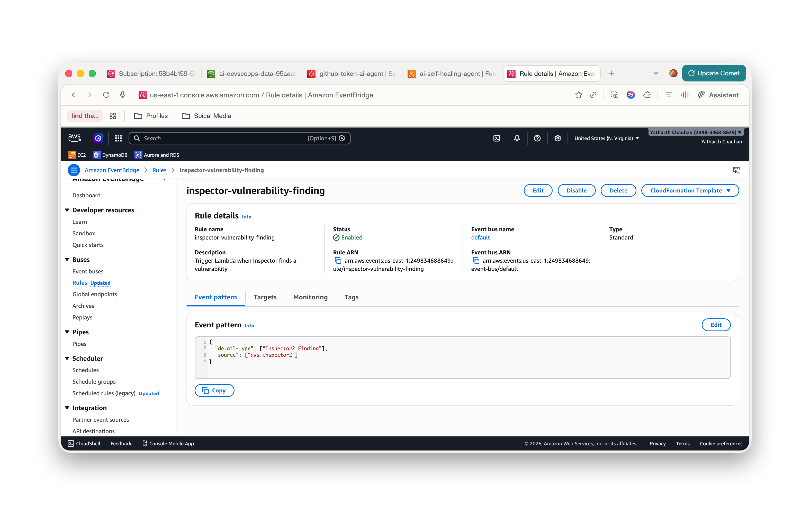

# From Frustration to Flow: Building a Self-Healing DevSecOps Pipeline on AWS


## Introduction

If you’ve ever been overwhelmed by a flood of security vulnerabilities, you’re not alone. I’ve been there—scrolling through endless alerts, patching the same issues again and again, wishing there was a better way. That’s when I decided to build a solution that could spot, analyze, and fix vulnerabilities as part of my DevSecOps pipeline.

In this blog, I’ll share how I solved this problem using AWS services and automation. I’ll walk you through the architecture, the practical steps, and the code that made my pipeline self-healing—so you can spend less time firefighting and more time building.

---

Modern software teams face a relentless stream of security vulnerabilities. What if your pipeline could not only detect, but also automatically fix these issues—no human intervention required? This article provides a deep dive into building an AI Agent–driven, self-healing DevSecOps pipeline on AWS, leveraging Lambda, Terraform, and Amazon Bedrock (Claude 3 Haiku).

---


## What Are We Building?

We’re building a pipeline that acts like a DevSecOps engineer who never sleeps:

- **Observes** your code for vulnerabilities and dependency risks
- **Thinks** with the help of GenAI (Amazon Bedrock) to decide the best fix
- **Acts** by automatically patching, creating Pull Requests, and alerting your team

All of this happens on AWS, using Lambda, Terraform, and a suite of cloud-native services. The result? A self-healing pipeline that keeps your software secure, 24/7.

---

## Architecture: How the Magic Happens

The pipeline is designed to work like a 24/7 DevSecOps engineer, using an AI Agent to automatically detect, analyze, and fix vulnerabilities. The process is simple:

- **Observe:** The system monitors code dependencies and security alerts.
- **Think:** The AI Agent (powered by GenAI) analyzes vulnerabilities and decides the best fix.
- **Act:** The Agent applies the fix, creates a Pull Request, and notifies the team.


### AI Agent Architecture



*Figure 1: The AI Agent follows an Observe → Think → Act loop, continuously learning and monitoring to keep your code secure.*

### Self-Healing Pipeline Architecture



*Figure 2: End-to-end architecture showing how Lambda, SNS, GitHub Actions, Inspector, Bedrock, and AWS storage services work together for automated remediation.*

This architecture ensures that every step, from vulnerability detection to automated remediation and alerting, is handled without manual intervention. For more details, see the full architecture in `docs/architecture.md` or refer to your aws.pdf documentation if you need deeper clarification.

---


## The AWS Services Behind the Scenes

| Service            | Purpose                                                      |
|--------------------|--------------------------------------------------------------|
| AWS Lambda         | Runs the AI Agent logic                                      |
| Amazon Bedrock     | Provides Claude 3 Haiku for vulnerability analysis           |
| Amazon S3          | Stores SBOMs and AI analysis reports                         |
| AWS Secrets Manager| Secures GitHub tokens                                        |
| Amazon SNS         | Sends notifications when a fix is applied                    |
| Amazon EventBridge | Routes Inspector findings to Lambda                          |
| AWS IAM + OIDC     | Keyless authentication for GitHub Actions                    |
| Amazon CloudWatch  | Logs and metrics for Lambda                                  |

---


## Project Structure at a Glance

```
.
├── lambda/
│   └── index.mjs              # AI Agent (Observe → Think → Act)
├── scripts/
│   ├── generate-sbom.js       # CycloneDX SBOM generator
│   └── scan-vulns.js          # Vulnerability scanner
├── terraform/
│   └── main.tf                # All AWS infrastructure (IaC)
├── docs/
│   ├── demo/                  # AWS Console screenshots
│   ├── architecture.md        # System design and data flow
│   ├── setup-guide.md         # Step-by-step deployment
│   ├── demo-walkthrough.md    # Live demo guide
│   ├── aws-console-guide.md   # Console navigation guide
│   └── troubleshooting.md     # Common errors and fixes
├── index.js                   # Sample vulnerable application
└── package.json
```

---


## Step-by-Step: How It All Works


### 1. Infrastructure as Code with Terraform

All AWS resources are provisioned using Terraform. Here’s a snippet from `terraform/main.tf` that provisions the Lambda function and its permissions:

```hcl
resource "aws_lambda_function" "ai_self_healing" {
	function_name = "ai-self-healing-agent"
	role          = aws_iam_role.lambda_role.arn
	handler       = "index.handler"
	runtime       = "nodejs18.x"
	filename      = data.archive_file.lambda_zip.output_path
	environment {
		variables = {
			SECRET_ID    = aws_secretsmanager_secret.github_token.name
			GITHUB_OWNER = var.github_owner
			GITHUB_REPO  = var.github_repo
			BASE_BRANCH  = var.base_branch
			SNS_TOPIC_ARN = aws_sns_topic.alerts.arn
			S3_BUCKET    = aws_s3_bucket.data_bucket.id
			USE_MOCK_AI  = var.use_mock_ai ? "true" : "false"
		}
	}
}
```

*See the full Terraform code in the [terraform/main.tf](terraform/main.tf) file.*

---


### 2. Lambda: The AI Agent Brain

The Lambda function is the “brain” of the pipeline. When triggered by a vulnerability report or AWS Inspector finding, it:

1. Fetches the GitHub token from Secrets Manager.
2. Calls Amazon Bedrock to analyze the vulnerability and recommend a fix.
3. Creates a new branch and Pull Request in GitHub with the fix and an AI-generated explanation.
4. Publishes a notification to SNS and stores a detailed report in S3.


#### Key Lambda Code (lambda/index.mjs)

```js
export const handler = async (event) => {
	// ...existing code...
	// 1. Parse vulnerability
	// 2. Analyze with Bedrock
	// 3. Create PR in GitHub
	// 4. Notify via SNS and store report in S3
};

async function getFixedVersionFromAI(vuln) {
	// Calls Bedrock Claude 3 Haiku with vulnerability details
	// Returns fixed version and explanation
}
```

*See the full Lambda logic in [lambda/index.mjs](lambda/index.mjs).*

---


### 3. GitHub Actions: The CI/CD Heartbeat

The pipeline is triggered on every push. It:
- Installs dependencies
- Generates a CycloneDX SBOM
- Scans for vulnerabilities
- Uploads SBOM to S3
- Invokes the Lambda AI Agent if vulnerabilities are found


#### Example SBOM Generation (scripts/generate-sbom.js)

```js
const sbom = {
	bomFormat: "CycloneDX",
	specVersion: "1.4",
	// ...
	components: Object.entries(pkg.dependencies || {}).map(([name, version]) => ({
		name,
		version,
		type: "library",
		purl: `pkg:npm/${name}@${version}`
	}))
};
```


#### Example Vulnerability Scan (scripts/scan-vulns.js)

```js
if (components.lodash) {
	const current = components.lodash;
	if (current.startsWith('4.17.1') && current !== '4.17.21') {
		vulns.push({
			package: 'lodash',
			currentVersion: current,
			cve: 'CVE-2020-8203',
			severity: 'HIGH',
			description: 'Lodash versions prior to 4.17.21 are vulnerable...',
			recommendedVersion: '4.17.21'
		});
	}
}
```

---


## See It in Action

### GitHub Actions Pipeline Success



### Lambda Function in AWS Console



### Lambda CloudWatch Metrics



### Amazon S3 SBOM Storage



### Amazon S3 Bucket Console



### AWS Secrets Manager: GitHub Token



### Amazon SNS: Alerts Topic



### EventBridge Inspector Rule



---


## End-to-End Flow: From Bug to Fix

1. Developer pushes code with a vulnerable dependency.
2. GitHub Actions runs, generates SBOM, and scans for vulnerabilities.
3. If a vulnerability is found, Lambda is invoked.
4. Lambda analyzes and fixes the issue, creates a PR, and notifies the team.
5. The team reviews and merges the PR—vulnerability resolved!

---


## Explore the Code

- **GitHub Repository:** [https://github.com/Nency-Ravaliya/self-healing-devsecops-pipeline](https://github.com/Nency-Ravaliya/self-healing-devsecops-pipeline)
- **Full Architecture:** [docs/architecture.md](docs/architecture.md)
- **Setup Guide:** [docs/setup-guide.md](docs/setup-guide.md)
- **Demo Walkthrough:** [docs/demo-walkthrough.md](docs/demo-walkthrough.md)

*Inspired by AWS She Builds Tech: Empowering women to lead in cloud and security innovation.*
