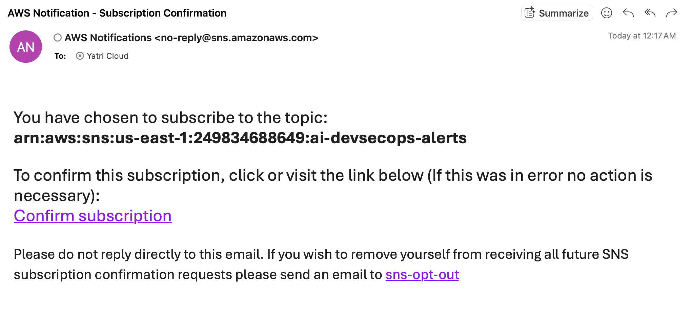

# Demo — AWS Console Screenshots

Live screenshots from the deployed AI Self-Healing DevSecOps pipeline.

---

## GitHub Actions — Pipeline Success

All steps completed successfully: SBOM generated, vulnerability scanned, uploaded to S3, and Lambda invoked.

---

## AWS Lambda — AI Agent Function

The `ai-self-healing-agent` Lambda function with EventBridge trigger configured.

---

## Lambda CloudWatch Metrics

Lambda invocations, duration, and success rate metrics confirming the AI Agent ran successfully.

---

## Amazon S3 — SBOM Storage

The S3 bucket `ai-devsecops-data-95aaa281` with SBOMs uploaded by the CI pipeline.

---

## Amazon S3 — Bucket Console

The S3 bucket created by Terraform for storing SBOMs and AI analysis reports.

---

## AWS Secrets Manager — GitHub Token

The GitHub PAT stored securely as `github-token-ai-agent`.

---

## Amazon SNS — Alerts Topic

The `ai-devsecops-alerts` SNS topic that sends notifications when a fix is applied.

---

## SNS — Email Subscription Confirmation

Email received when subscribing to the SNS topic.

---

## Amazon EventBridge — Inspector Rule

The `inspector-vulnerability-finding` rule that routes AWS Inspector findings to the Lambda function.

